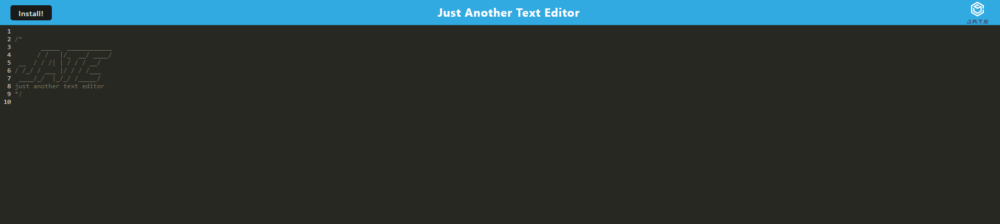
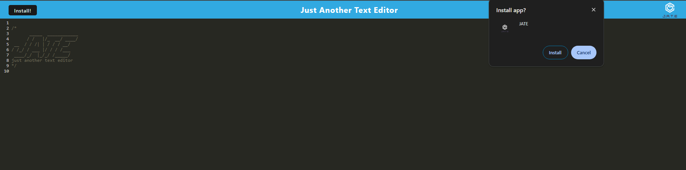
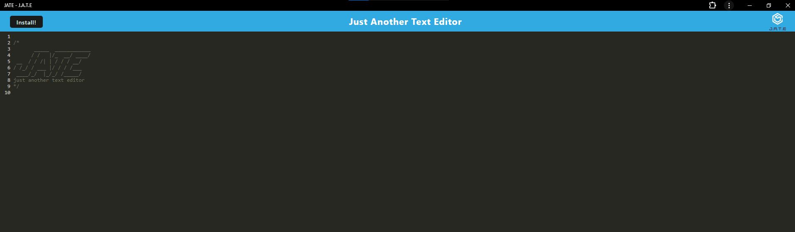

# brandon-pwa-text-editor

[Live Deploy Link]()


## Description

As a developer, it is important to be able to know and understand all different kinds of web applications. The project for this week was to create a text editor that functionally can be used without any internet. Included are also ways to preserve data such as service workers, manifest file, and pre caching static assets in case a browser or feature isn't avaliable. This application uses both client and server folders. The client folder and frontend are built using webpack, and everything can be run with npm commands.

## Table of contents

- [Installation](#installation)
- [Usage](#usage)
- [Collaborators](#collaborators)
- [Questions](#questions)

## Installation

1. Clone the repository from `GitHub`
2. Install or have `Node.js`, installed.
3. Open the cloned repository in `VSCode`.
4. Open the project inside the root integrated terminal.
5. Use the command `npm i` to install all package dependencies.

   This will install the dependencies:

```
- express
- @babel/core
- @babel/plugin-proposal-object-rest-spread
- @babel/plugin-transform-runtime
- @babel/preset-env
- @babel/runtime
- babel-loader
- css-loader
- eslint
- html-webpack-plugin
- http-server
- style-loader
- webpack
- webpack-cli
- webpack-dev-server
- webpack-pwa-manifest
- workbox-webpack-plugin
```

## Usage

1. Start the application using the command `npm run start` in the root integrated terminal.
2. Open the `client` folder and also open the created `dist` folder.
3. Right click the `index.html` in the `dist` folder and click `Open In Default Browser`.
4. Click the `Install` button in the top left, where a prompt with the option to `Cancel` or `Install` the applicaiton will appear.
5. After installation, a desktop icon should appear for the application.
6. Click the desktop icon to start the application.
7. Features include offline editing, persistent content, and integrated service workers.'

### Website Application Page



### Install Prompt



### Installed Application



## Collaborators

Starter code was provided by https://github.com/coding-boot-camp/cautious-meme

## Questions

You are welcome to contact me with questions using the following:

- [GitHub Profile](https://github.com/bwing2)

- [Email](mailto:brandon.wing245@gmail.com)
